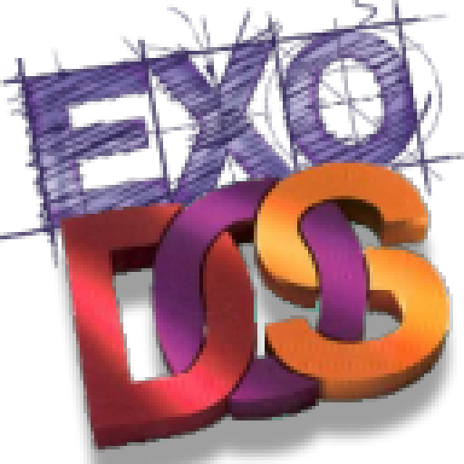
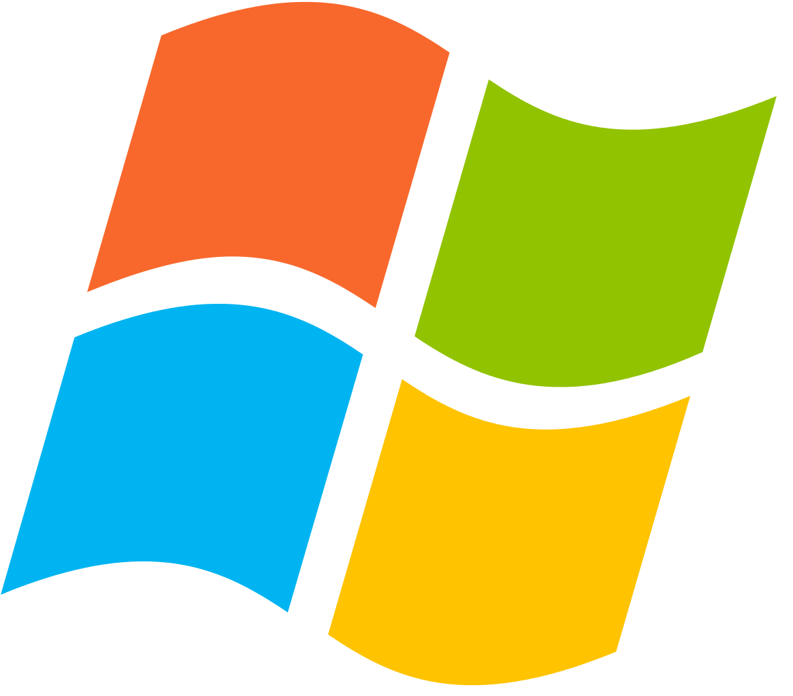

<p align="center">
  
  <br>
  
</p>

<p align="center">
  <strong>A modern game library manager and launcher built with Rust and Qt/QML.</strong>
  <br>
  Theophany is a desktop client for managing and launching game collections on Linux.
</p>

<p align="center">
  
</p>

## Features

### Library Management
- **Resizable UI**: Interactive resizable sidebar and details panel for a customized interface.
- **ROM Support**: Import individual ROMs or folders for dozens of consoles via drag and drop.
- **Emulator Management**: Manage emulators with pre-defined profiles, or create your own.
- **Media & Metadata**: Pull box art, backgrounds, and game data from IGDB.
- **Video Explorer**: Search, stream, or download trailers and clips using `yt-dlp`.
- **Global Search**: Floating island interface for searching across your entire library.
- **Real-time Filtering**: Dedicated collection filters for the game list (genre, region, year, rating).
- **Mass Edit**: Update metadata for multiple games at once.
- **Resource Manager**: Manage external links for manuals, wikis, and strategy guides.
- **Playlists**: Further organize games into manual lists.
- **Themes**: 15+ built-in color palettes including **System** (inherits and matches your OS accent colors), Nord, Dracula, and Tokyo Night.

### Storefront & System Integration
- **Direct Store Bridges**: Sync libraries and data from major storefronts.
  -  **Steam**: Full cloud library sync (installed & uninstalled), achievement tracking, and playtime data.
  -  **Legendary (Epic Games)**: Full storefront support for your entire Epic library, including installation management, cloud saves, and overlay support.
  <p align="center">
  </p>
  -  **Heroic** &  **Lutris**: Sync installed games and playtime data.
-  [**eXoDOS Linux**](https://www.retro-exo.com/linux.html): Direct integration for importing and launching eXoDOS collections with Linux patches.
-  **Flatpak Integration**: Manage and install Flatpak applications within the interface.

<p align="center">
  </p>

### Running & Compatibility
-  **UMU Core**: Proton and Wine management based on the Universal Management Utility.
- **Game Profiles**: Per-game configuration for Proton versions, prefixes, wrappers, and environment variables.
- **Gamescope Support**: Integrated configuration for Gamescope sessions.

###  RetroAchievements Integration
- **Dashboard**: View account rank, total points, and gaming history.
- **Progress Tracking**: Real-time achievement progress and badge tracking.
- **Metadata Sync**: Automatic fetching of achievement-related icons and box art.

### Planned Features
- **GOG Integration**: Support for cloud library import and launching directly from GOG. Comet integration for achievement, and overlay.
- **Advanced Playlists**: Dynamic grouping based on automated filters.
- **Feature Requests**: Community feedback and requests are encouraged.

---

## Getting Started

### Prerequisites

- **Rust**: [Install Rust](https://www.rust-lang.org/tools/install) (2021 edition).
- **Qt 6.2+**: Required for the QML frontend.
- **PROTOC**: Protocol Buffers compiler for internal API layers.
- **yt-dlp**: Required for video fetching.
- **Ollama** (Optional): For local metadata synthesis.

### Installation & Running

**Download the binary**

Download the [latest release](https://github.com/oldlamps/theophany/releases/latest) from the releases page.

Directly from your console

```bash
  wget https://github.com/oldlamps/theophany/releases/download/latest/theophany_linux_x64
  mv ./theophany_linux_x64 ~/.local/bin/theophany
  theophany
```

**Arch Linux (AUR)**
```bash
  yay -S theophany-bin
```

**Manual Installation**

1. Clone the repository:
   ```bash
   git clone https://github.com/oldlamps/theophany.git
   cd theophany
   ```

2. Run the application:
   ```bash
   cargo run
   ```

3. Release Build:
   ```bash
   ./build_release.sh
   ```

---

## Documentation

For more detailed guides and technical information, check the [docs](/docs) directory.

## License

GNU General Public License v3.0
